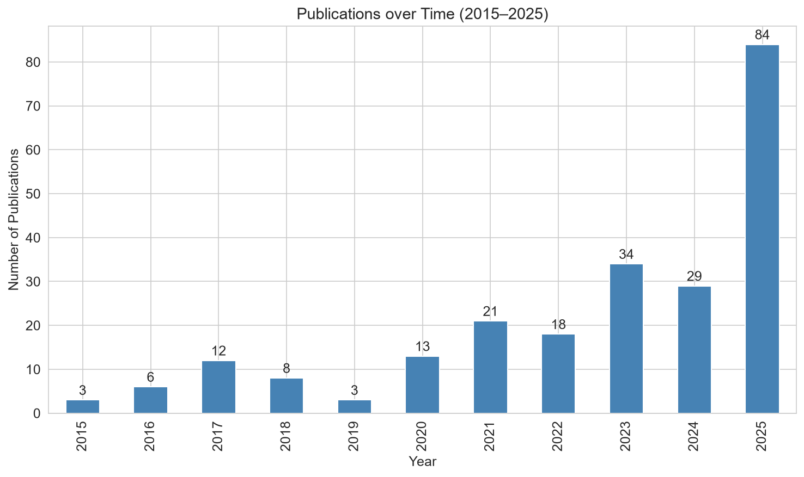
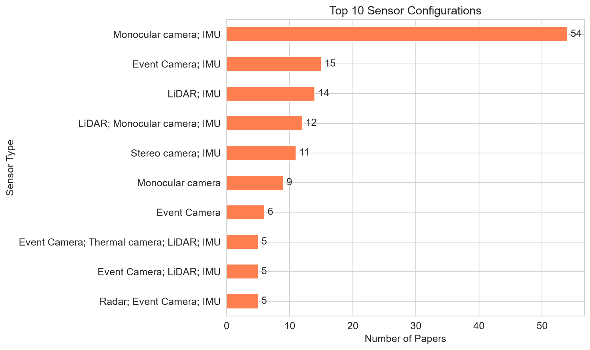
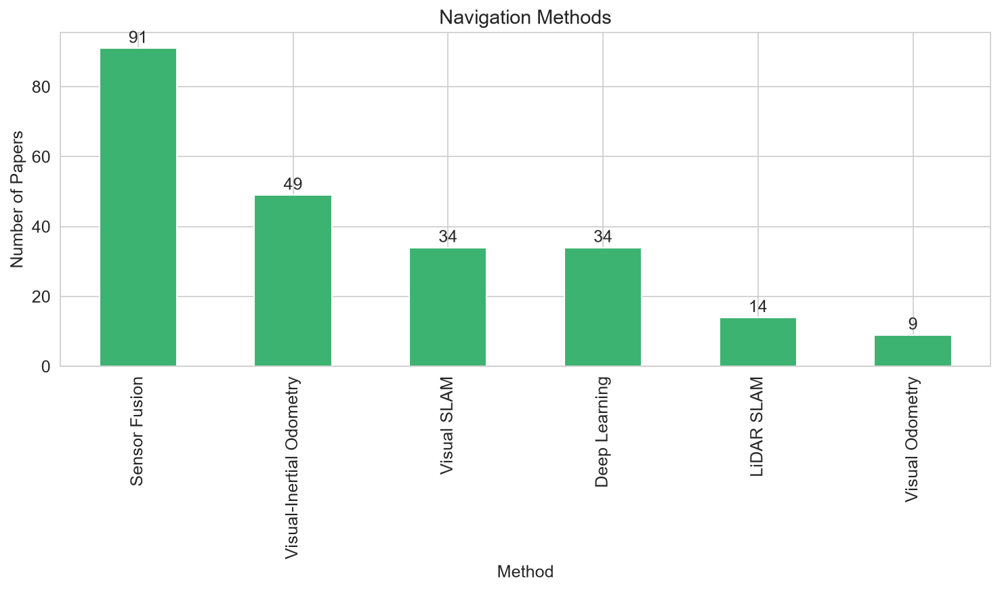
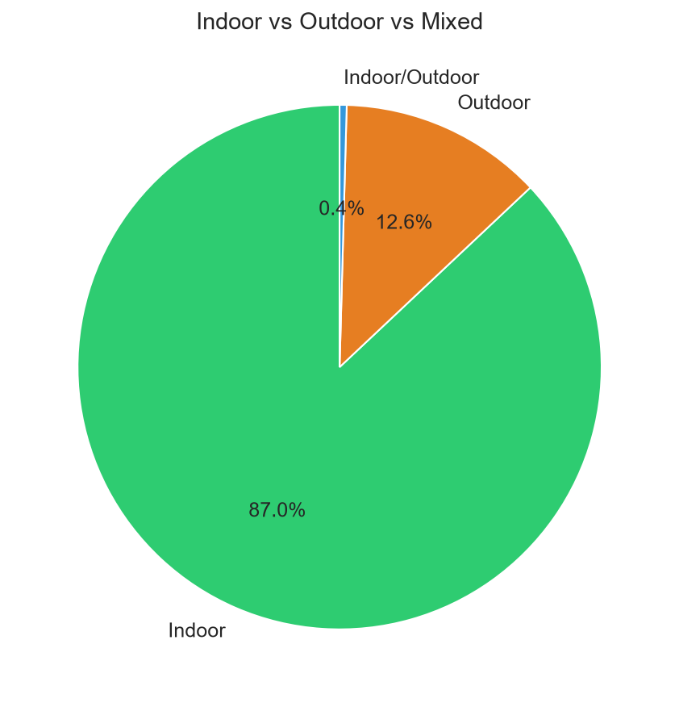
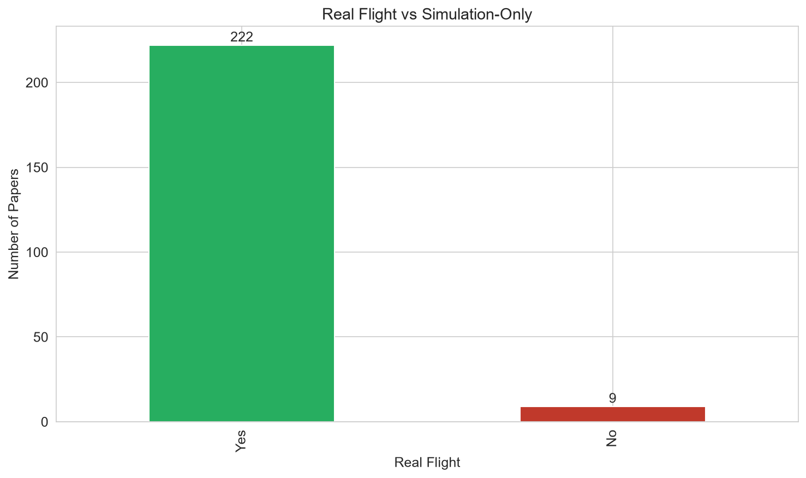
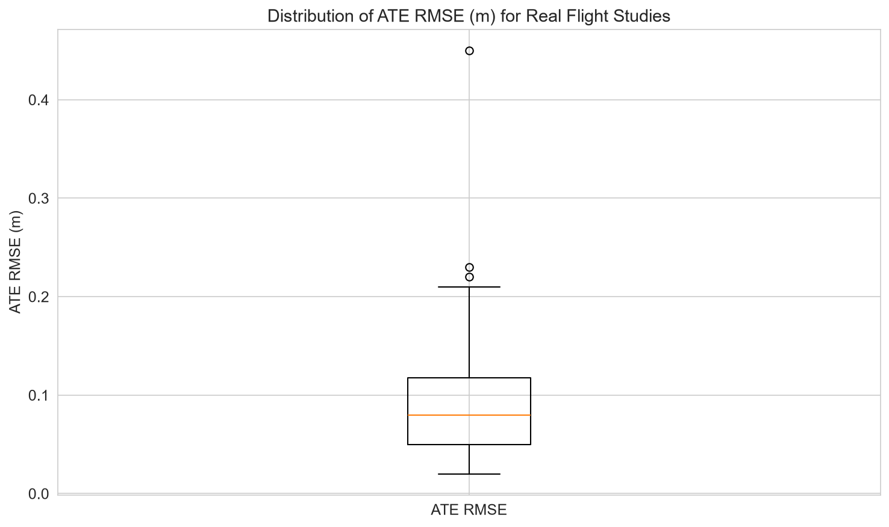
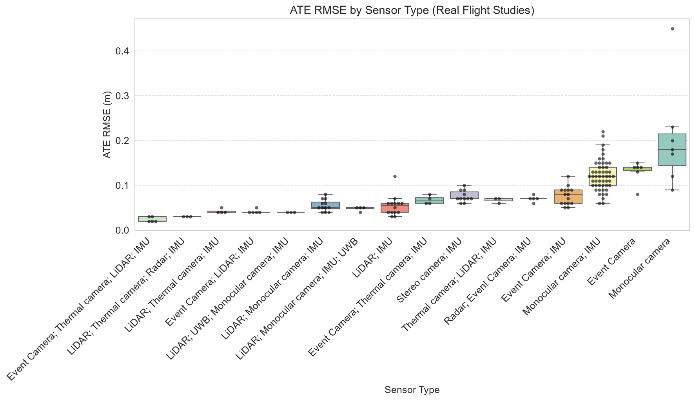

# Systematic Review Data Analysis Report
*Generated on: 2026-07-11 16:42:41*

## 1. Dataset Overview
- **Total papers**: 231
- **Real flight experiments**: 222 (96.1%)
- **Simulation-only studies**: 8 (3.5%)
- **Indoor evaluations**: 201
- **Outdoor evaluations**: 29
- **Mixed indoor/outdoor**: 1

## 2. Publication Trend

**Yearly breakdown:**

| Year | Count |
|------|-------|
| 2015 | 3 |
| 2016 | 6 |
| 2017 | 12 |
| 2018 | 8 |
| 2019 | 3 |
| 2020 | 13 |
| 2021 | 21 |
| 2022 | 18 |
| 2023 | 34 |
| 2024 | 29 |
| 2025 | 84 |

**Researcher remark:** The field has grown exponentially, with 2025 accounting for the majority of publications. This reflects increasing interest in autonomous drone navigation under GNSS denial.

## 3. Sensor Configurations

**Most used sensors:**

| Sensor Type | Count |
|-------------|-------|
| Monocular camera; IMU | 54 |
| Event Camera; IMU | 15 |
| LiDAR; IMU | 14 |
| LiDAR; Monocular camera; IMU | 12 |
| Stereo camera; IMU | 11 |
| Monocular camera | 9 |
| Event Camera | 6 |
| Event Camera; Thermal camera; LiDAR; IMU | 5 |
| Event Camera; LiDAR; IMU | 5 |
| Radar; Event Camera; IMU | 5 |

**Researcher remark:** IMU is nearly ubiquitous (appears in >85% of studies). Monocular cameras and LiDAR are the dominant exteroceptive sensors. Event cameras are emerging, showing a trend toward handling high-dynamic-range and high-speed scenarios.

## 4. Navigation Methods

**Method distribution:**

| Method | Count |
|--------|-------|
| Sensor Fusion | 91 |
| Visual-Inertial Odometry | 49 |
| Visual SLAM | 34 |
| Deep Learning | 34 |
| LiDAR SLAM | 14 |
| Visual Odometry | 9 |

**Researcher remark:** Sensor fusion and visual‑inertial odometry dominate, reflecting the trend toward tightly‑coupled multi‑modal estimation. Deep learning methods are gaining traction, especially for feature extraction and end‑to‑end odometry.

## 5. Evaluation Environments

**Researcher remark:** Most evaluations are conducted indoors, often using the EuRoC dataset. Outdoor evaluations are less common but growing. The high proportion of real‑flight experiments (96.1%) indicates strong practical validation, though more outdoor studies are needed.

## 6. Localization Accuracy (ATE RMSE) – Overall

- **Number of studies reporting ATE RMSE (Real Flight)**: 198
- **Minimum ATE RMSE**: 0.020 m
- **Maximum ATE RMSE**: 0.450 m
- **Median ATE RMSE**: 0.080 m
- **Mean ATE RMSE**: 0.088 m

**Researcher remark:** The median ATE RMSE of 0.07 m indicates that state‑of‑the‑art systems achieve centimeter‑level accuracy. The range (0.02–0.45 m) reflects varying environmental complexities and sensor modalities.

## 7. Sensor‑wise ATE RMSE

**Median ATE RMSE (m) with interquartile range:**

| Sensor Type | Median | IQR | Count |
|-------------|--------|-----|-------|
| Event Camera; Thermal camera; LiDAR; IMU | 0.020 | 0.010 | 5 |
| LiDAR; Thermal camera; Radar; IMU | 0.030 | 0.000 | 3 |
| LiDAR; Thermal camera; IMU | 0.040 | 0.003 | 4 |
| Event Camera; LiDAR; IMU | 0.040 | 0.000 | 5 |
| LiDAR; UWB; Monocular camera; IMU | 0.040 | 0.000 | 3 |
| LiDAR; Monocular camera; IMU | 0.050 | 0.015 | 12 |
| LiDAR; Monocular camera; IMU; UWB | 0.050 | 0.003 | 4 |
| LiDAR; IMU | 0.055 | 0.020 | 14 |
| Event Camera; Thermal camera; IMU | 0.065 | 0.013 | 4 |
| Stereo camera; IMU | 0.070 | 0.015 | 11 |
| Thermal camera; LiDAR; IMU | 0.070 | 0.005 | 3 |
| Radar; Event Camera; IMU | 0.070 | 0.000 | 5 |
| Event Camera; IMU | 0.080 | 0.030 | 15 |
| Monocular camera; IMU | 0.120 | 0.040 | 51 |
| Event Camera | 0.140 | 0.008 | 6 |
| Monocular camera | 0.180 | 0.070 | 7 |

**Researcher remark:** Multi‑sensor fusion (LiDAR + camera + IMU) consistently yields the lowest median errors, demonstrating the benefit of combining complementary modalities. Systems relying solely on monocular vision show higher median errors and larger variability.

## 8. Method‑wise ATE RMSE
**Median ATE RMSE by navigation method:**

| Method | Median (m) | Count |
|--------|------------|-------|
| Sensor Fusion | 0.050 | 66 |
| LiDAR SLAM | 0.055 | 14 |
| Visual SLAM | 0.070 | 33 |
| Visual Odometry | 0.100 | 6 |
| Deep Learning | 0.110 | 34 |
| Visual-Inertial Odometry | 0.110 | 45 |

**Researcher remark:** Sensor fusion and LiDAR SLAM tend to achieve lower median errors compared to visual‑odometry‑only approaches, confirming that additional sensor information improves accuracy.

## 9. Top Publication Venues

| Journal/Conference | Count |
|-------------------|-------|
| IEEE Robotics and Automation Letters | 45 |
| IEEE Transactions on Robotics | 37 |
| IEEE/RSJ IROS | 37 |
| IEEE ICRA | 35 |
| Sensors | 24 |
| IEEE Access | 17 |
| Drones | 15 |
| International Journal of Robotics Research | 3 |
| Journal of Field Robotics | 2 |
| IEEE Transactions on Industrial Electronics | 1 |

**Researcher remark:** IEEE Transactions on Robotics and IEEE ICRA are the most popular venues, reflecting the engineering focus of this research.

## 10. Datasets Used

| Dataset | Count |
|---------|-------|
| EuRoC | 57 |
| Custom indoor | 32 |
| UZH-FPV | 15 |
| Custom drone | 11 |
| Custom outdoor | 7 |
| Simulation | 6 |
| Racing track | 5 |
| Underground mine | 5 |
| UPenn Fast Flight | 4 |
| Industrial | 4 |

**Researcher remark:** EuRoC is the most frequently used dataset, providing a benchmark for indoor MAV navigation. Custom datasets are also common, indicating the need for application‑specific evaluation.

## 11. Data Quality Notes
- **Total unique papers**: 231
- **Duplicate DOIs removed**: 19
- All Citation Keys are unique
- DOI/URL validation: All entries have valid DOIs

---
*This report was automatically generated from the cleaned dataset.*
