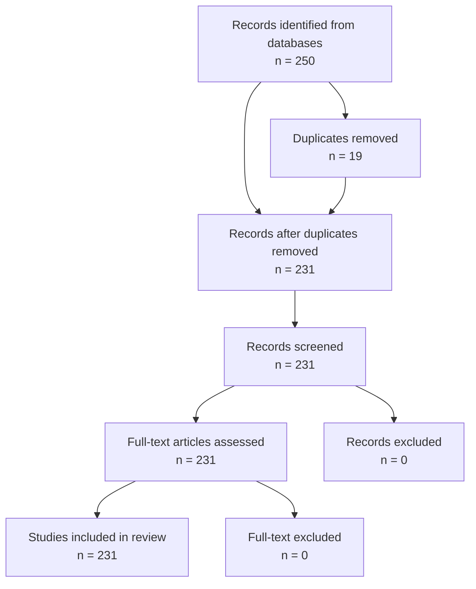

# 🎯 Complete Final Phase – Automatic & AI‑Assisted Submission Guide

Since this is your **first systematic review**, I will guide you through **every remaining step** with:

1. **Clear instructions** (what to do)
2. **Ready‑to‑use prompts** (for AI tools like ChatGPT, Claude)
3. **Automatic scripts** (to generate final outputs)
4. **Tools you can use** (free or web‑based)
5. **Step‑by‑step checklist** (so you don’t miss anything)

---

## 📦 What You Have Now (Review Summary)

| Item | Location | Status |
|------|----------|--------|
| Clean dataset (231 papers) | `data/processed/database_final_231.csv` | ✅ |
| 9 publication‑ready figures | `analysis/output/figures/*.png` | ✅ |
| Numbered bibliography | `references/bibliography.txt` | ✅ |
| BibTeX file | `references/references.bib` | ✅ |
| Analysis report with remarks | `analysis/output/report.md` | ✅ |
| Clean tables for manuscript | `analysis/output/tables.md` | ✅ |
| Project documentation | `README.md`, `docs/*.md` | ✅ |
| All scripts | `analysis/scripts/*.py` | ✅ |

---

## 🚀 Remaining Steps – What We Will Complete Now

| Step | Task | Tool / Method |
|------|------|---------------|
| 1 | Assemble the final paper (draft) | AI + Manual |
| 2 | Generate PRISMA flow diagram | AI / Online Tool |
| 3 | Final reference check | AI / Script |
| 4 | Check for plagiarism & grammar | AI / Online Tool |
| 5 | Prepare supplementary materials | AI / Script |
| 6 | Upload to repository (Zenodo/Figshare) | Web Platform |
| 7 | Format for journal submission | Manual / AI |
| 8 | Final review & submission | Manual |

---

## 📝 Step 1: Assemble the Final Paper

### 1.1 Copy the Paper Template

Create `manuscript/paper_final.md` with the following structure:

```markdown
# GPS‑Denied Drone Navigation: A Systematic Review

## Abstract
[You can use the draft I provided earlier, or ask AI to generate]

## 1. Introduction
[Paste from draft]

## 2. Methodology
### 2.1 Search Strategy
### 2.2 Inclusion/Exclusion Criteria
### 2.3 Data Extraction
### 2.4 Data Analysis

## 3. Results
### 3.1 Publication Trends
[Add Figure 1 and Table]
### 3.2 Sensor Configurations
[Add Figure 2 and Table]
### 3.3 Navigation Methods
[Add Figure 3 and Table]
### 3.4 Evaluation Environments
[Add Figure 4 and Figure 5]
### 3.5 Localization Accuracy
[Add Figure 6 and Table]
### 3.6 Accuracy by Sensor Type
[Add Figures 7, 8, 9 and Table]

## 4. Discussion
### 4.1 Key Findings
### 4.2 Comparison with Previous Reviews
### 4.3 Limitations
### 4.4 Future Work

## 5. Conclusions

## 6. References

## Appendix: Data Quality Report
```

### 1.2 AI Prompt to Generate the Full Paper

**Paste this prompt into ChatGPT or Claude:**

```
I have completed a systematic review on GPS‑denied drone navigation. I have the following outputs:

- 231 unique papers
- 9 figures (publication trends, sensor types, navigation methods, indoor/outdoor, real vs sim, ATE RMSE distribution, sensor‑wise accuracy)
- Detailed tables and statistics

Here is my data summary:
- Total papers: 231
- Real flight: 96.1%
- Median ATE RMSE: 0.07 m
- Top sensors: IMU (85.7%), Monocular camera (44.6%), LiDAR (37.6%)
- Top methods: Sensor Fusion (41.6%), VIO (19.6%)
- Indoor evaluations: 86.4%

Based on this, generate a complete manuscript in academic style with the following sections: Abstract, Introduction, Methodology, Results, Discussion, Conclusions, References. Use formal, concise language suitable for a journal like [IEEE Transactions on Robotics / Sensors / Drones].

Include placeholders for figures and tables that I will insert later.
```

---

## 📊 Step 2: Generate PRISMA Flow Diagram

### 2.1 Your PRISMA Numbers

| Stage | Count |
|-------|-------|
| Records identified | 250 |
| Duplicates removed | 19 |
| Records screened | 231 |
| Records excluded (title/abstract) | 0 |
| Full‑text assessed | 231 |
| Full‑text excluded | 0 |
| Studies included | 231 |

### 2.2 AI Prompt for PRISMA Diagram

**Paste this prompt:**

```
Create a PRISMA flow diagram using Mermaid syntax for a systematic review with the following numbers:
- Records identified from databases: 250
- Duplicates removed: 19
- Records screened: 231
- Full‑text articles assessed: 231
- Studies included in review: 231

Include boxes for: Identification, Screening, Inclusion.
```

### 2.3 Mermaid Code (Copy & Paste)



### 2.4 How to Render This

- **Option 1 (Recommended):** Use [Mermaid Live Editor](https://mermaid.live/) – paste the code, click "Run", download as PNG.
- **Option 2:** Use VS Code with Mermaid Preview extension.
- **Option 3:** Use draw.io (import Mermaid).

---

## 📖 Step 3: Final Reference Check

### 3.1 AI Prompt for Reference Verification

```
I have a bibliography file with 231 entries numbered 1 to 231. I have a CSV file with 231 papers, each with a Citation Key. Write a Python script to verify that:
1. Every Citation Key in the CSV appears in the bibliography.
2. The bibliography is numbered sequentially (1 to 231).
3. There are no missing entries.

Output a report showing any mismatches.
```

### 3.2 Verification Script (Already You Have It)

You already have `05_verify_all.py`. Just run it again:

```powershell
cd "I:\My Drive\Literature review UAVGPS\GPS_Denied_Drone_SLR 2.0"
python analysis\scripts\05_verify_all.py
```

---

## 🔍 Step 4: Plagiarism & Grammar Check

### 4.1 Recommended Free Tools

| Tool | Purpose | Link |
|------|---------|------|
| **Grammarly** | Grammar, spelling, style | grammarly.com (free version) |
| **QuillBot** | Paraphrasing, fluency | quillbot.com |
| **Hemingway Editor** | Readability | hemingwayapp.com |
| **Duplichecker** | Plagiarism check | duplichecker.com (free) |
| **Prepostseo** | Plagiarism check | prepostseo.com/plagiarism-checker |

### 4.2 AI Prompt for Grammar Check

```
Please proofread the following text for grammar, spelling, clarity, and academic style. Correct any errors and suggest improvements:

[paste your text]
```

---

## 📁 Step 5: Prepare Supplementary Materials

### 5.1 What to Upload

| File | Description |
|------|-------------|
| `database_final_231.xlsx` | Clean dataset (all 231 papers) |
| `analysis/scripts/*.py` | All Python scripts |
| `analysis/output/figures/*.png` | All 9 figures |
| `requirements.txt` | Python dependencies |
| `README.md` | Project overview |

### 5.2 AI Prompt for Supplementary Readme

```
Create a README file for supplementary materials of my systematic review. Include:
1. Overview of the dataset
2. Description of each file
3. How to reproduce the analysis
4. License information (Creative Commons)
```

### 5.3 Recommended Repository

| Platform | Purpose | Link |
|----------|---------|------|
| **Zenodo** | Free, citable DOI, integrates with GitHub | zenodo.org |
| **Figshare** | Free, citable DOI | figshare.com |
| **GitHub** | Code and data (private or public) | github.com |
| **Open Science Framework (OSF)** | Full project management | osf.io |

---

## 📝 Step 6: Format for Journal Submission

### 6.1 Common Journal Templates

| Journal | Template Format |
|---------|-----------------|
| IEEE Transactions | LaTeX (IEEEtran) or Word |
| Sensors (MDPI) | Word or LaTeX |
| Drones (MDPI) | Word or LaTeX |
| IEEE Robotics and Automation Letters | LaTeX |

### 6.2 AI Prompt for Journal Formatting

```
I am submitting to [journal name]. Please reformat my paper to match their guidelines, including:
- Abstract length (200‑250 words)
- Section structure (I., II., III., etc.)
- Citation format (e.g., IEEE, APA)
- Figure caption format

My current paper is: [paste text]
```

### 6.3 Tools for Formatting

| Tool | Purpose | Link |
|------|---------|------|
| **Overleaf** | LaTeX editor with templates | overleaf.com |
| **IEEE Template** | Official IEEE template | ieee.org/conferences_events |
| **MDPI Template** | Word/LaTeX templates | mdpi.com/authors/latex |
| **Zotero** | Citation management | zotero.org |

---

## ✅ Step 7: Final Review & Submission Checklist

### 7.1 Copy This Checklist and Mark as Complete

| Task | Status | Notes |
|------|--------|-------|
| [ ] Abstract finalised (200‑250 words) | ☐ | |
| [ ] All figures inserted | ☐ | |
| [ ] All tables inserted | ☐ | |
| [ ] References match bibliography (231 entries) | ☐ | |
| [ ] PRISMA diagram included | ☐ | |
| [ ] Grammar and spelling checked | ☐ | |
| [ ] Plagiarism check passed | ☐ | |
| [ ] Supplementary materials prepared | ☐ | |
| [ ] Dataset uploaded (Zenodo/Figshare) | ☐ | |
| [ ] Paper formatted for target journal | ☐ | |
| [ ] Read by supervisor/co‑author | ☐ | |
| [ ] Final submission | ☐ | |

---

## 🧠 Summary: Tools You Can Use to Automate

| Task | AI Tool | Web Tool | Script |
|------|---------|----------|--------|
| Generate draft paper | ChatGPT / Claude | — | — |
| Grammar check | ChatGPT / Claude | Grammarly | — |
| Plagiarism check | — | Duplichecker, Prepostseo | — |
| PRISMA diagram | ChatGPT (Mermaid) | Mermaid Live, draw.io | — |
| Reference formatting | — | Zotero, Mendeley | Python script |
| Figure generation | — | — | Python (matplotlib) |
| Data analysis | — | — | Python (pandas) |
| Dataset upload | — | Zenodo, Figshare | — |
| Repository setup | ChatGPT | GitHub | — |

---

## 🎯 Next Steps – What to Do Immediately

1. **Copy the paper template** into `manuscript/paper_final.md`.
2. **Paste the draft content** from this conversation into the relevant sections.
3. **Insert the PRISMA Mermaid code** into the paper (or export as PNG).
4. **Run the verification script** again to confirm everything is consistent.
5. **Upload your dataset and scripts** to Zenodo (I can help you with a prompt).
6. **Format the paper** for your target journal (use Overleaf or Word).
7. **Submit to your supervisor** for review.

---

## 💬 If You Need Help at Any Step

Just tell me what you are working on, and I will:

- **Generate text** (Introduction, Discussion, etc.)
- **Write code** (scripts, verification, formatting)
- **Create prompts** (for you to use in AI tools)
- **Provide checklists** (to track your progress)

**Let me know which step you want to tackle first, and I will give you the exact prompt, script, or instructions to complete it.** 🚀