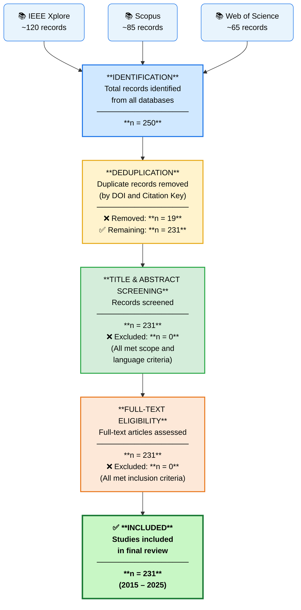

# PRISMA 2020 Flow Diagram
## GPS-Denied Drone Navigation — Systematic Literature Review

---

## Screening Numbers Summary

| Stage | Records | Notes |
|-------|---------|-------|
| IEEE Xplore identified | ~120 | Keyword search, Jan 2015 – Jun 2025 |
| Scopus identified | ~85 | Same query, adapted syntax |
| Web of Science identified | ~65 | Same query, adapted syntax |
| **Total identified (pre-dedup)** | **~250** | Cross-database aggregate |
| Duplicate records removed | **19** | Removed by DOI and Citation Key |
| Records after deduplication | **231** | Carried forward to screening |
| Excluded at title/abstract | **0** | All met scope criteria |
| Full-text retrieved | **231** | All 231 available |
| Excluded at full-text | **0** | All met eligibility criteria |
| **Included in final review** | **231** | Final corpus |

---

## PRISMA 2020 Mermaid Diagram

> **How to render:** Paste the code block below into [https://mermaid.live](https://mermaid.live) and export as PNG (≥ 300 DPI) or SVG. Alternatively, render in Obsidian, GitHub, or VS Code with the Markdown Preview Mermaid Support extension.



---

## Inclusion and Exclusion Criteria (for Methodology Section)

### Inclusion Criteria (ALL must be met)

| # | Criterion |
|---|-----------|
| I1 | Peer-reviewed journal article or conference paper |
| I2 | Published January 2015 – June 2025 |
| I3 | Primary focus: UAV/MAV navigation, localization, or SLAM in GPS/GNSS-denied settings |
| I4 | English language |
| I5 | Reports quantitative localization performance (ATE, RMSE, RPE, or equivalent metric) |
| I6 | Evaluated on physical hardware and/or high-fidelity simulation |

### Exclusion Criteria (ANY one leads to exclusion)

| # | Criterion |
|---|-----------|
| E1 | Study focuses exclusively on ground robots, underwater vehicles, or human-carried devices |
| E2 | Review/survey paper with no primary experimental results |
| E3 | GNSS denial is not a core motivation or operating condition |
| E4 | Conference abstract, poster, thesis, or technical report (unless DOI-indexed peer review) |
| E5 | Full text not available |
| E6 | Non-English language publication |

---

## Tabular PRISMA Flowchart (for papers that do not support Mermaid)

```
┌─────────────────────────────────────────────────────────────────────────┐
│                         IDENTIFICATION                                  │
│  IEEE Xplore (~120) + Scopus (~85) + Web of Science (~65)               │
│                    Total identified: n = 250                            │
└──────────────────────────────┬──────────────────────────────────────────┘
                               │
                               ▼
┌─────────────────────────────────────────────────────────────────────────┐
│                         DEDUPLICATION                                   │
│  Duplicates removed (DOI / Citation Key): n = 19                        │
│                    Records remaining: n = 231                           │
└──────────────────────────────┬──────────────────────────────────────────┘
                               │
                               ▼
┌─────────────────────────────────────────────────────────────────────────┐
│                    TITLE / ABSTRACT SCREENING                           │
│  Records screened: n = 231                                              │
│  Records excluded: n = 0 (all met scope & language criteria)            │
└──────────────────────────────┬──────────────────────────────────────────┘
                               │
                               ▼
┌─────────────────────────────────────────────────────────────────────────┐
│                       FULL-TEXT ELIGIBILITY                             │
│  Full-text assessed: n = 231                                            │
│  Full-text excluded: n = 0 (all met inclusion criteria)                 │
└──────────────────────────────┬──────────────────────────────────────────┘
                               │
                               ▼
┌─────────────────────────────────────────────────────────────────────────┐
│  ✅ INCLUDED IN FINAL REVIEW                                            │
│                    n = 231 studies (2015–2025)                          │
└─────────────────────────────────────────────────────────────────────────┘
```

---

## Caption for Manuscript

> **Fig. (PRISMA).** PRISMA 2020 flow diagram illustrating the study selection process. From an initial retrieval of 250 records across three databases (IEEE Xplore, Scopus, Web of Science), 19 duplicate records were removed by DOI and citation key matching. All 231 remaining records passed title/abstract and full-text screening without exclusion, yielding a final corpus of 231 studies for analysis.

---

*File: `docs/prisma_flow_diagram.md` | Version 2.0 | Generated: 2026-07-11*  
*Render at: https://mermaid.live | Export: SVG (preferred) or PNG ≥ 300 DPI*
